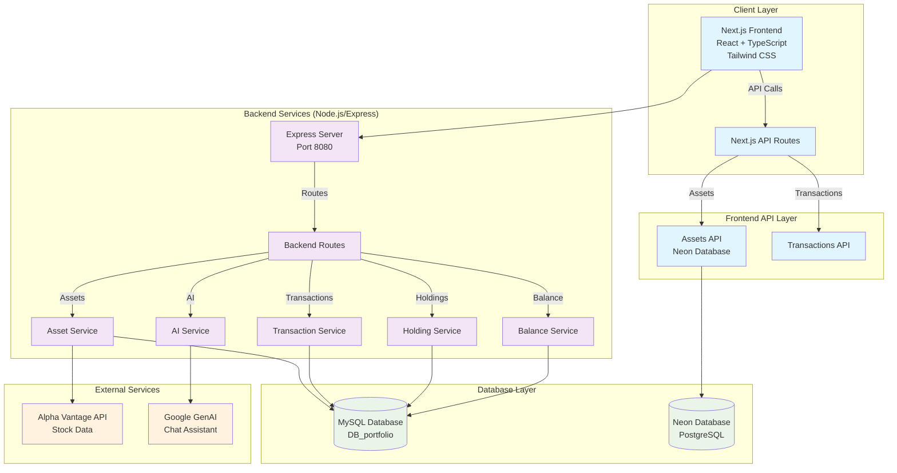

# Portfolio Manager System Architecture

## System Overview

The Portfolio Manager is a full-stack web application built with Next.js frontend and Node.js/Express backend, featuring real-time stock data integration, portfolio management, and AI-powered chat assistance.

## Architecture Diagram

## Component Details

### 1. Frontend Layer (Next.js 15.4.4)

- **Framework**: Next.js with React 19.1.0 and TypeScript
- **Styling**: Tailwind CSS with Radix UI components
- **State Management**: React hooks (useState, SWR for data fetching)
- **Key Components**:
  - `StockList`: Market watchlist with real-time data
  - `PriceTrend`: Interactive price charts using Recharts
  - `PortfolioList`: Current holdings display
  - `TransactionHistory`: Trade history with filtering
  - `TradeWindow`: Buy/sell transaction interface
  - `AccountCard`: Balance and account overview
  - `ChatBot`: AI-powered investment assistant

### 2. Frontend API Routes (Next.js API)

- **Assets API** (`/api/assets`): Connects to Neon PostgreSQL database
- **Transactions API** (`/api/transactions`): Handles trade operations

### 3. Backend Services (Node.js/Express)

- **Server**: Express.js running on port 8080
- **API Routes**:
  - `/assets`: Stock data management and Alpha Vantage integration
  - `/transactions`: Trade execution and validation
  - `/holdings`: Portfolio position tracking
  - `/balance`: Account balance management
  - `/ai`: Google GenAI chat integration

### 4. Database Layer

- **Primary Database**: MySQL (DB_portfolio)
  - `transactions`: Trade records with triggers for validation
  - `holdings`: Current portfolio positions
  - `asset_quotes_live`: Real-time stock quotes
  - `asset_prices_daily`: Historical daily prices
  - `asset_prices_intraday`: Intraday price data
- **Secondary Database**: Neon PostgreSQL
  - `assets`: Asset metadata and historical data

### 5. External Integrations

- **Alpha Vantage API**: Real-time and historical stock data
  - Global Quote endpoint for live prices
  - Time Series endpoints for historical data
  - Rate limiting and error handling
- **Google GenAI**: AI-powered investment chat assistant

## Data Flow

### Stock Data Pipeline

1. **Data Collection**: Asset service fetches data from Alpha Vantage API
2. **Storage**: Data stored in MySQL tables with proper indexing
3. **Synchronization**: Periodic sync service updates live quotes
4. **Frontend Display**: Real-time data served to React components

### Transaction Flow

1. **Validation**: Backend validates trade requests (insufficient shares prevention)
2. **Execution**: Database triggers maintain data consistency
3. **Updates**: Holdings automatically updated after transactions
4. **History**: Complete audit trail maintained

### AI Chat Flow

1. **User Input**: Chat interface in React frontend
2. **Processing**: Google GenAI processes investment queries
3. **Response**: Contextual investment advice and portfolio insights

## Security Features

- **Input Validation**: Server-side validation for all transactions
- **Database Triggers**: Prevents overselling and maintains data integrity
- **Environment Variables**: Secure API key management

## Performance Optimizations

- **Database Indexing**: Optimized queries with proper indexes
- **Connection Pooling**: MySQL connection management
- **SWR Caching**: Frontend data caching and revalidation
- **Rate Limiting**: API call throttling for external services

## Deployment Architecture

- **Frontend**: Next.js application (likely deployed on Vercel)
- **Backend**: Node.js/Express server (containerized deployment)
- **Databases**:
  - MySQL: Self-hosted or cloud provider
  - Neon: Serverless PostgreSQL

## Scalability Considerations

- **Microservices Ready**: Modular backend architecture
- **Database Sharding**: Separate databases for different data types
- **Caching Layer**: Redis integration potential for high-frequency data
- **Load Balancing**: Multiple backend instances support
